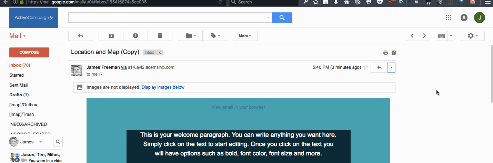

Decode Gmail emails to get their original HTML source

####Demo

####Usage

Open an email in Gmail, then click the extension's button to get the HTML source of the email.

For now, it will get the source of the first email in the thread. To get a specific email from a thread, open the original version of your email, and then click on the extension's button.

For now it just looks for QP encoded HTML, with a simple message that matches ActiveCampaign emails.

####Installation

#####Firefox

First [enable unsigned extensions](http://www.thewindowsclub.com/allow-unsigned-extensions-installed-firefox), then [install the addon manually](https://www.accessfirefox.org/Install_Addon_Manually.php)

The latest version of the addon is [bin/gmaildecode.xpi](bin/gmaildecode.xpi)

#####Chrome

[Load this folder as an unpacked extension](https://developer.chrome.com/extensions/getstarted#unpacked)